# No More Long, Ugly Links! Recommend 14 Smart Retargeting Game-Changers!

Link sharing shouldn't feel like throwing messages into a void where you never know who clicked, where they came from, or what happened next. Every URL you post on social media, emails, or ads represents potential customers slipping through your fingers without retargeting options or conversion tracking. Modern link management platforms transform basic URLs into smart marketing assets with retargeting pixels, call-to-action overlays, branded domains, and detailed analytics that tell you exactly what's working. Whether you're driving traffic from Instagram, running Facebook campaigns, or sharing content across multiple platforms, these 14 tools convert ordinary links into trackable, brandable, retargetable connections with your audience.

***

## **[RocketLink](https://rocketlink.io)**

The retargeting specialist that turns every link into an audience-building machine.

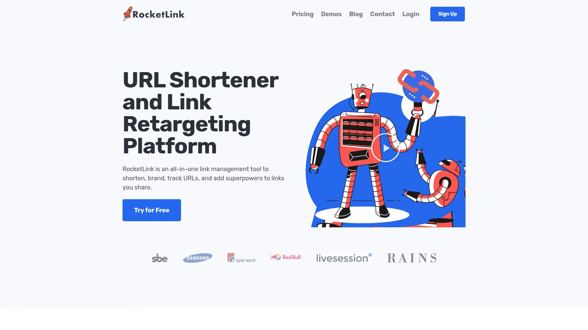

RocketLink operates on a powerful premise: every person clicking your links should become part of your retargetable audience, even when you're sharing content you don't own. The platform adds retargeting pixels from Facebook, Google, LinkedIn, and other advertising platforms to any URL you share, building custom audiences as people click your links. This means sharing an interesting article in a Facebook group or sending a YouTube video to your email list automatically adds those clickers to your remarketing pools. No website ownership required—you're building audiences from external content.

Custom call-to-action overlays drive traffic back to your properties when people view external content you've shared. These CTAs appear as simple bars or popups on the destination page, featuring your messaging and links. You can embed opt-in forms from your email provider, chatbox scripts, YouTube videos, or any JavaScript-based tool directly into links you share. Password protection secures sensitive links, custom thumbnails control how links display when shared socially, and vanity URLs maintain clean branding. Custom 404 redirects ensure dead links still send visitors somewhere useful.

The analytics dashboard tracks all links and clicks in one location, showing geographic data, device types, referral sources, and time-based trends. UTM tags integrate automatically for campaign tracking across Google Analytics. Chrome and Firefox browser extensions let you create smart links directly from any page you're viewing. GDPR consent options ensure European compliance for data collection. Custom domains replace generic short URLs with your branded domains, building trust and recognition. The platform includes QR code generation for offline marketing that still captures digital tracking data.

Cross-platform retargeting campaigns run from audiences you've built through link clicks, letting you reach people interested in specific content or product categories. The system works particularly well for marketers without websites who still want to leverage Facebook Pixel and other retargeting technologies. Integration capabilities connect with marketing automation platforms, CRM systems, and analytics tools through JavaScript embedding. For businesses treating links as marketing assets rather than simple redirects, RocketLink delivers comprehensive functionality centered on audience building and conversion optimization.

***

## **[Bitly](https://bitly.com)**

Enterprise-grade reliability with extensive integrations and trusted by millions.

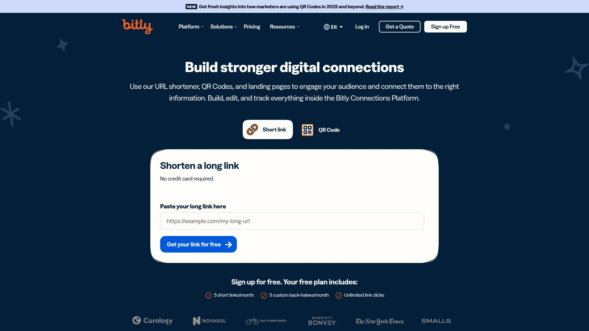

Bitly built its reputation as the most recognizable name in URL shortening, processing billions of clicks monthly across millions of users. That scale brings advantages: rock-solid uptime, lightning-fast redirects, and infrastructure capable of handling massive traffic spikes without hiccups. Enterprise teams appreciate detailed analytics showing click patterns, geographic distribution, device types, and referral sources for every shortened link. The platform supports custom domains for branded short links that reinforce your identity instead of advertising Bitly.

Link-in-bio functionality competes directly with dedicated tools by creating mobile-optimized landing pages displaying multiple links from a single URL. QR code generation connects offline marketing to digital tracking, monitoring scans with the same detailed analytics as regular links. API access enables developers to integrate link shortening into applications, automation workflows, and marketing platforms. Mobile apps for iOS and Android extend functionality beyond desktop, letting teams create and manage links from anywhere.

The interface emphasizes simplicity and speed, removing friction from link creation while maintaining access to advanced features for power users. Team collaboration features include shared workspaces, permission controls, and centralized billing for organizations. Integration capabilities span hundreds of marketing tools, social media platforms, and analytics systems through direct connections and API access. Support quality remains consistently high with responsive assistance for technical issues and account questions.

Free plans provide basic functionality with reasonable limits for casual users and small projects. Paid tiers unlock custom domains, advanced analytics, higher volume limits, and team features starting around $8 monthly. For businesses seeking established reliability, comprehensive integrations, and name recognition that builds trust with audiences, Bitly represents the safe, proven choice.

---

## **[Rebrandly](https://rebrandly.com)**

Branded domain specialists with unlimited custom domains on free plans.

Rebrandly differentiates itself by offering custom branded domains even on free accounts, which removes a significant barrier preventing small businesses from professional link branding. Research shows branded links receive 39% more clicks than generic short URLs, making domain customization crucial for marketing effectiveness. The platform supports unlimited branded domains across all plan levels, letting you create different short link brands for various products, campaigns, or client accounts.

Analytics dive deeper than basic click counting, providing geographic data, device information, referral sources, and time-based trending for every link. Data ownership remains entirely with you—full export capabilities and unlimited retention mean your analytics never disappear or get locked behind paywalls. Link gallery functionality creates link-in-bio pages for social media with customizable layouts and branding. Seven ready-made integration libraries plus 22 e-commerce platform plugins accelerate implementation across diverse tech stacks.

Advanced features on premium plans include destination routing that sends different visitors to different URLs based on device type, location, or other parameters. Retargeting pixel support adds Facebook, Google, and other tracking codes to shortened links. UTM builder functionality streamlines campaign tracking parameter creation. QR code generation produces both static and dynamic codes with customizable designs and tracking. Teams benefit from workspace management, role-based permissions, and collaboration features designed for marketing departments.

The interface leans toward feature richness over minimalism, which can feel overwhelming initially but provides extensive control once mastered. Mobile applications maintain full functionality for link creation and management on the go. Pricing starts free with meaningful capabilities, scaling to paid plans around $29 monthly for advanced features and higher volumes. For businesses prioritizing branded links and data ownership, Rebrandly delivers strong value despite interface complexity.

---

## **[Replug](https://replug.io)**

Conversion-focused platform with CTAs, A/B testing, and deep retargeting.

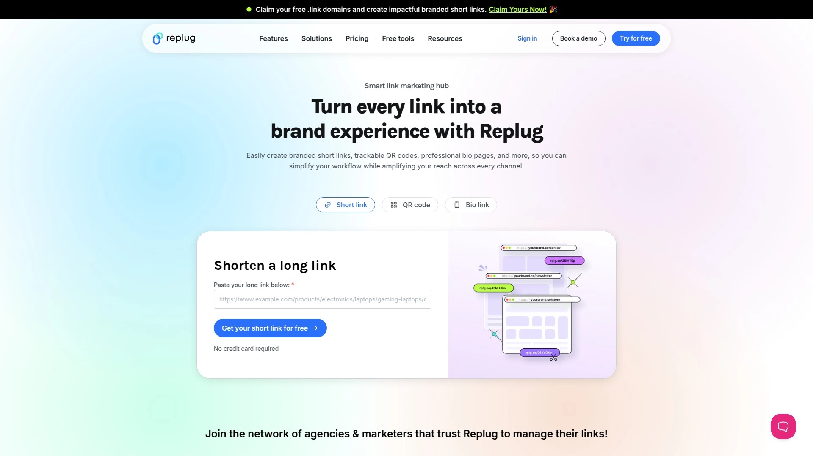

Replug positions itself as a complete link management solution emphasizing conversion optimization over simple shortening. Call-to-action overlays transform every link into a lead generation opportunity by displaying custom messages, forms, or offers when visitors view destination content. These CTAs work on external websites you don't own, letting you monetize shared content through popups, banners, or embedded widgets. Retargeting pixels from Facebook, Google, Twitter, LinkedIn, and other platforms attach to every shortened link, building remarketing audiences automatically as people click.

A/B testing capabilities let you create multiple versions of shortened links pointing to different destinations, then automatically distribute traffic to determine which performs better. Deep linking routes mobile visitors to app stores or opens content directly in native applications instead of mobile browsers. Traffic routing segments visitors by device type, geographic location, or date, sending each group to optimized destinations. This geo-targeting proves valuable for international businesses showing different content to various regions.

Bio link functionality creates comprehensive landing pages for Instagram, TikTok, and other platforms limiting profiles to single URLs. White-label solutions enable agencies to offer branded link management services to clients with custom domains and interface theming. Workspace management separates multiple brands, clients, or campaigns within single accounts. Analytics track clicks, conversions, geographic data, device information, and campaign performance through unified dashboards.

Custom branded domains reinforce your identity with every link shared. QR code generation produces trackable codes for offline marketing. Browser extensions for Chrome and Firefox simplify link creation from any webpage. API access enables automation and integration with existing marketing systems. Pricing starts at $19 monthly for essential features, scaling to $99 monthly for agency plans. For marketers treating links as conversion tools rather than simple redirects, Replug provides comprehensive functionality.

***

## **[Linktree](https://linktree.com)**

The link-in-bio pioneer with 50+ million users and simple setup.

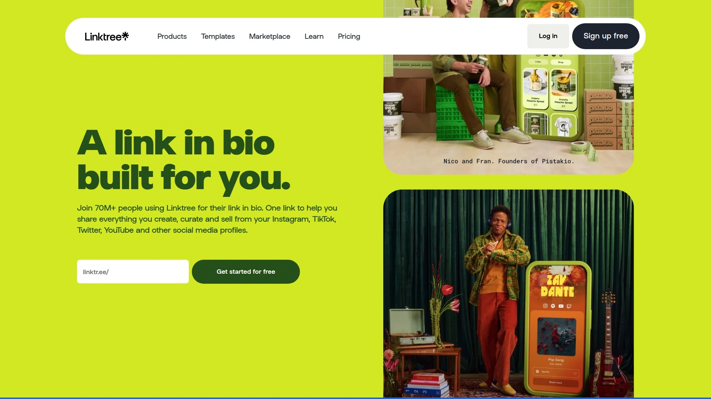

Linktree created the link-in-bio category back when Instagram's single-link limitation frustrated creators trying to share multiple destinations. The platform's massive user base—over 50 million accounts—demonstrates its accessibility and effectiveness for social media linking. Setup takes literally minutes: choose a username, add links with titles and thumbnails, customize colors and fonts, then place your Linktree URL in your social media bio. Followers clicking your bio link see a mobile-optimized page listing all your destinations.

Free plans include unlimited links, basic customization, and simple analytics showing total clicks per link. Paid upgrades add custom backgrounds, priority support, email collection, link scheduling, and removal of Linktree branding. Video links embed directly into your page instead of redirecting, keeping visitors engaged within your Linktree environment. Social icons connect to all your platforms in one place. The platform integrates with email marketing tools, analytics systems, and e-commerce platforms.

Analytics on premium plans show click patterns, traffic sources, device types, and geographic data. Multiple link appearances let you assign different layouts or themes to various link categories. The interface maintains extreme simplicity, making it accessible even for non-technical users. Mobile apps provide full editing capabilities for updating links and checking analytics on the go. Support quality varies, with free users relying on help articles while paid subscribers access priority assistance.

Platform recognition means audiences familiar with Linktree trust the experience and know how to navigate link pages. The massive user base also means Linktree URLs get shared millions of times daily, building further brand recognition. For creators and small businesses needing simple, trusted link-in-bio functionality without complexity, Linktree delivers exactly what its name promises.

***

## **[Short.io](https://short.io)**

Advanced targeting with geographic routing and device-specific redirects.

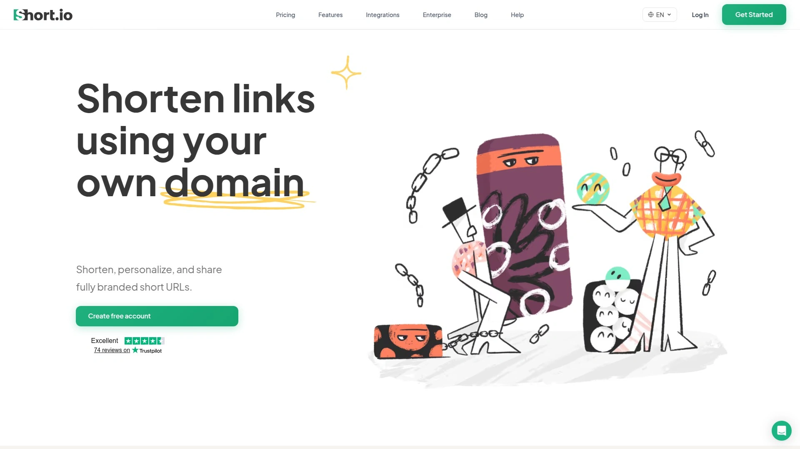

Short.io specializes in intelligent link routing that sends different visitors to different destinations based on their characteristics. Geographic targeting redirects users from specific countries, regions, or cities to localized content, which proves valuable for international businesses tailoring experiences by location. Device targeting sends mobile visitors to app stores or mobile-optimized pages while desktop users see full websites. These routing capabilities operate automatically based on rules you configure once.

Branded domains give your short links professional appearance using your own domain names. Multiple domains manage from single accounts, letting you maintain separate link brands for different purposes. Link cloaking hides destination URLs until after redirection, useful for masking ugly parameters or tracking codes. Password protection secures sensitive links. Link expiration automatically disables URLs after specified dates, perfect for time-limited offers or event registrations.

Deep linking connects mobile users directly to content within native applications instead of web browsers. UTM builder functionality generates campaign tracking parameters automatically. QR code creation produces scannable codes for print materials and physical locations. API access enables programmatic link creation and management for developers. A/B testing splits traffic between multiple destinations to determine which performs better.

Analytics track clicks in real-time with detailed breakdowns by country, region, referrer, device, and browser. Link permissions control who can edit or view specific URLs within team environments. Bulk import and export handle large-scale link migration or management. Single sign-on (SSO) integrates with enterprise authentication systems. Pricing starts around $20 monthly with plans scaling based on clicks and features. For businesses needing sophisticated routing and targeting, Short.io delivers advanced capabilities.

***

## **[BL.INK](https://bl.ink)**

Enterprise link intelligence with real-time dashboards and UTM automation.

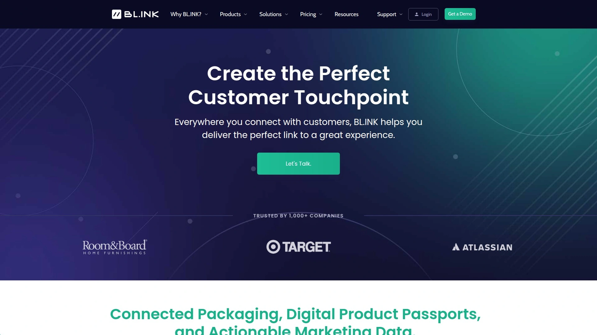

BL.INK targets enterprise marketing teams requiring advanced link management, analytics, and governance. The platform's URL builder tool simplifies UTM parameter creation with templates, approved value lists, and automatic validation. Administrators preload approved UTM values ensuring consistent tracking across all team members and campaigns. The system automatically shortens URLs as UTM parameters get added, streamlining workflow. Custom URL builders integrate with existing analytics platforms for enterprises with specific requirements.

Real-time analytics dashboards display link performance as clicks happen, tracking interactions and engagement instantly. Analytics data stores permanently without expiration, enabling long-term trend analysis. Click metrics update continuously with filtering options by timeframe, link owner, tags, device, or location. The ability to change destination URLs without breaking existing short links or losing historical data proves valuable during campaign adjustments. Teams organize links using tags, then sort and analyze performance by those organizational structures.

Branded domains replace generic short URLs with company-owned domains. QR code generation creates trackable offline-to-online connections. Bulk operations handle hundreds or thousands of links simultaneously for large-scale campaign management. Role-based permissions control which team members access specific links or data. API access enables integration with marketing automation, CRM, and analytics platforms.

Campaign tracking groups related links for aggregate performance analysis. The platform emphasizes data accuracy and governance, appealing to enterprises with strict compliance requirements. Support includes dedicated account management for enterprise customers. Pricing reflects the enterprise focus, starting around $600 monthly for premium features. For large marketing teams requiring robust governance and analytics, BL.INK delivers enterprise-grade capabilities.

***

## **[Sniply](https://sniply.io)**

Content marketing amplifier with call-to-action overlays on shared articles.

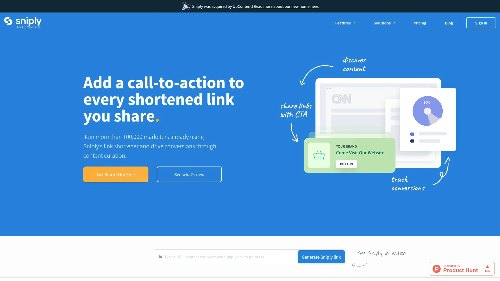

Sniply pioneered the concept of adding your own call-to-action messages to content you don't own, transforming content curation into lead generation. When you share an article, video, or resource through Sniply, your custom CTA appears as an overlay on that external content. This lets you drive traffic back to your website, capture email signups, or promote products while sharing valuable third-party content. The approach works particularly well for content marketers building authority by curating industry resources while still capturing leads.

Custom CTAs include text, images, buttons, and forms with flexible positioning and styling options. Multiple CTA variations let you test different messages or offers across various links. Analytics track both link clicks and CTA engagement, showing which overlays drive actions. Branded domains ensure your curated content reinforces your brand. The platform supports custom link slugs for readable, memorable short URLs.

Team collaboration features allow multiple marketers to create and manage links within shared workspaces. Integrations connect with major marketing platforms for automated workflows. The interface focuses specifically on content curation workflows rather than general link shortening, which means fewer extraneous features but more depth in its specialty. Browser extensions for Chrome simplify creating Sniply links as you browse the web.

Pricing operates on usage tiers based on monthly link clicks, starting free for limited use and scaling to $59 monthly for higher volumes. The platform doesn't include QR codes or deep linking capabilities, maintaining focus on its core CTA overlay functionality. For content marketers and businesses emphasizing thought leadership through curation, Sniply converts shared content into conversion opportunities.

***

## **[TinyURL](https://tinyurl.com)**

The original simplicity with straightforward shortening since 2002.

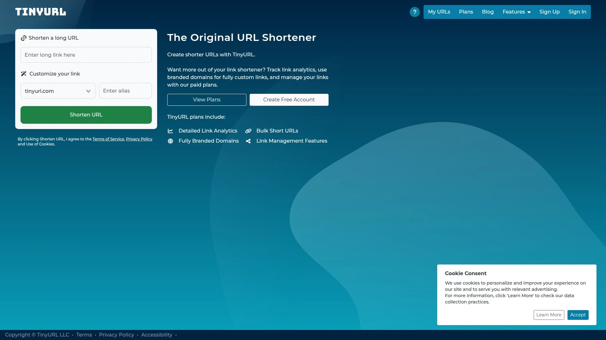

TinyURL predates most competitors by over two decades, maintaining its position through reliable, no-nonsense link shortening. The platform's defining characteristic involves extreme simplicity: paste a long URL, click shorten, receive a tiny URL. There's no required account creation, no complex features to navigate, no learning curve whatsoever. This simplicity appeals to users wanting quick link shortening without additional marketing features.

Free usage includes unlimited link creation with permanent URLs that never expire. Optional accounts unlock custom aliases, link editing, and basic analytics. The platform added campaign tracking in recent years, grouping related links for aggregate analysis. Paid plans starting around $9 monthly provide custom domains, detailed analytics, and priority support. Premium pricing reaches $129 monthly for higher volumes and advanced features.

The lack of sophisticated features like retargeting pixels, CTA overlays, or geographic routing means TinyURL serves a specific use case: straightforward shortening without complexity. This focused approach delivers faster operation and simpler interfaces compared to feature-heavy alternatives. Historical links created over TinyURL's 20+ year history remain functional, demonstrating long-term reliability. The recognizable brand builds trust with audiences familiar with the purple dinosaur logo.

Mobile functionality works through responsive web design rather than dedicated applications. Security includes SSL encryption for data transmission. The platform maintains consistent uptime and fast redirects despite offering free service. For users needing simple shortening without advanced marketing features, TinyURL remains a solid choice two decades after launch.

***

## **[T2M](https://t2mio.com)**

All-in-one affordability with dynamic QR codes and retargeting pixels.

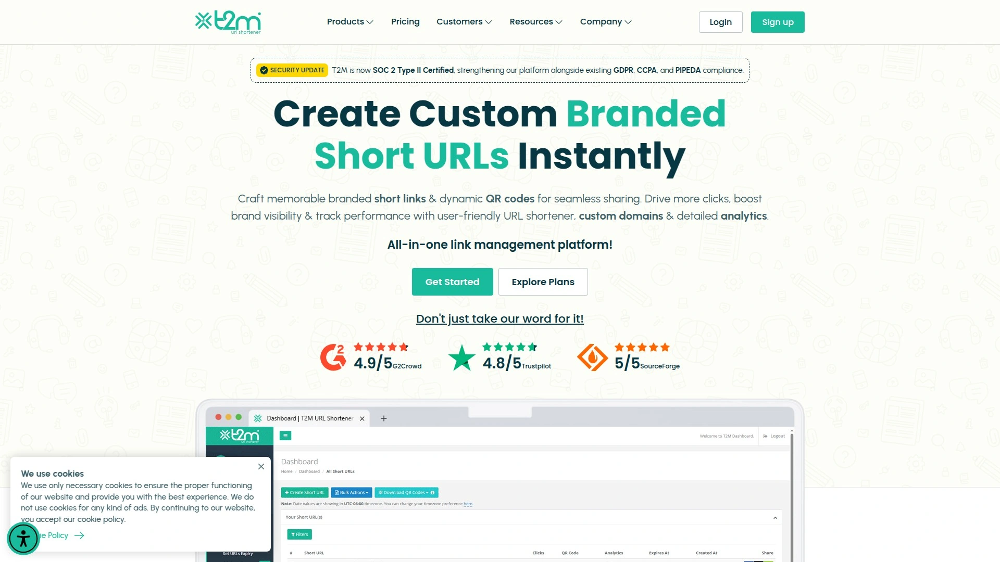

T2M positions itself as a comprehensive yet affordable platform offering advanced features typically found in premium tools. Retargeting pixel support adds tracking codes to shortened links, building remarketing audiences across major advertising platforms. This functionality competes directly with tools costing significantly more. Dynamic QR codes connect offline marketing to digital analytics, tracking scans by location, device, and time. URL cloaking hides destination addresses for cleaner appearance.

Branded custom domains create professional short links using your own domain names. Multiple domains manage from single accounts. A/B testing splits traffic between different destinations to optimize conversion rates. Link expiration automatically disables URLs after specified dates. Password protection secures sensitive links. Custom analytics reports filter data by timeframe, location, device, or campaign.

The platform tracks unique versus repeat clicks, helping identify genuine interest versus bot traffic. Geographic data breaks down clicks by country, state, city, and postal code. Device targeting information shows performance across desktop, mobile, and tablet. Browser and referrer source data reveals where traffic originates. UTM builder functionality generates campaign parameters automatically.

API access enables developers to integrate link management into applications and workflows. Bulk shortening handles large volumes efficiently. Team collaboration features support multiple users with role-based permissions. Browser extensions streamline link creation. Pricing starts at just $5 monthly, significantly undercutting competitors with similar feature sets. For budget-conscious businesses needing comprehensive functionality, T2M delivers impressive value.

***

## **[ClickMeter](https://clickmeter.com)**

Conversion tracking specialist measuring actual ROI from link campaigns.

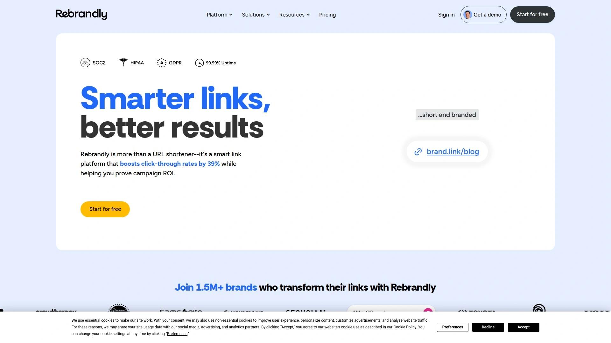

ClickMeter focuses specifically on conversion tracking and return calculation, going beyond basic click analytics to measure actual business results. The platform tracks clicks through to conversions and sales, calculating ROI for link-based campaigns. This end-to-end tracking helps marketers understand which links generate revenue versus just traffic. Integration with advertising platforms and analytics systems connects link data to broader marketing performance.

Tracking links include detailed parameters monitoring referral sources, campaigns, and user behavior. The system identifies conversion paths showing how customers moved from initial click to final purchase. Revenue attribution connects specific sales to the links that generated them. Real-time monitoring displays campaign performance as it happens. Automated alerts notify marketers when metrics hit thresholds or anomalies occur.

Link rotation distributes traffic among multiple destinations based on rules or percentages. This enables sophisticated testing beyond simple A/B splits. Geo-targeting routes visitors to location-specific landing pages. Device detection sends mobile and desktop users to appropriate destinations. Link cloaking masks affiliate or tracking parameters. QR code generation creates trackable offline-to-online connections.

API access enables integration with CRM systems, marketing platforms, and custom applications. Data export functionality allows analysis in external tools. Custom reporting builds dashboards tailored to specific business needs. The platform serves businesses prioritizing conversion measurement over vanity metrics like total clicks. Pricing reflects the professional focus with plans starting higher than basic shorteners. For marketers needing rigorous ROI tracking, ClickMeter delivers measurement-focused capabilities.

***

## **[Lnk.Bio](https://lnk.bio)**

Clean link-in-bio pages with reasonable pricing and custom domains.

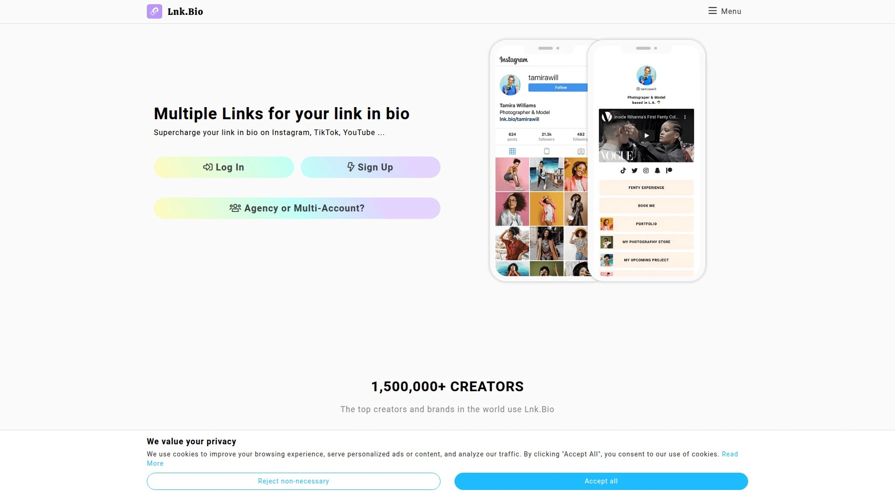

Lnk.Bio creates simple, fast-loading link-in-bio pages for Instagram, TikTok, and other single-link platforms. The interface emphasizes speed and simplicity, removing unnecessary features that complicate basic link listing. Custom usernames create clean URLs like lnk.bio/yourname. Free plans include basic functionality with Lnk.Bio branding. Paid upgrades starting at $0.99 monthly remove branding and unlock additional features.

Custom domains let you use your own domain names instead of lnk.bio subdomains, strengthening brand identity. Multiple link appearances support different visual themes for various audiences or purposes. Link scheduling shows or hides specific links based on date and time. Email collection captures visitor information for list building. Analytics track clicks per link with geographic and device data on premium plans.

The platform prioritizes mobile optimization ensuring fast load times even on slow connections. Minimal design keeps focus on your links rather than decorative elements. Integration with social media platforms enables automatic content pulling. Image galleries showcase visual content alongside text links. Video embedding displays content directly on your link page.

Setup completes in minutes without technical knowledge. The low price point makes premium features accessible to creators with limited budgets. Support operates through email and help documentation. For creators wanting clean, affordable link-in-bio functionality without complexity, Lnk.Bio delivers focused simplicity.

***

## **[Beacons](https://beacons.ai)**

All-in-one creator platform with monetization tools and email marketing.

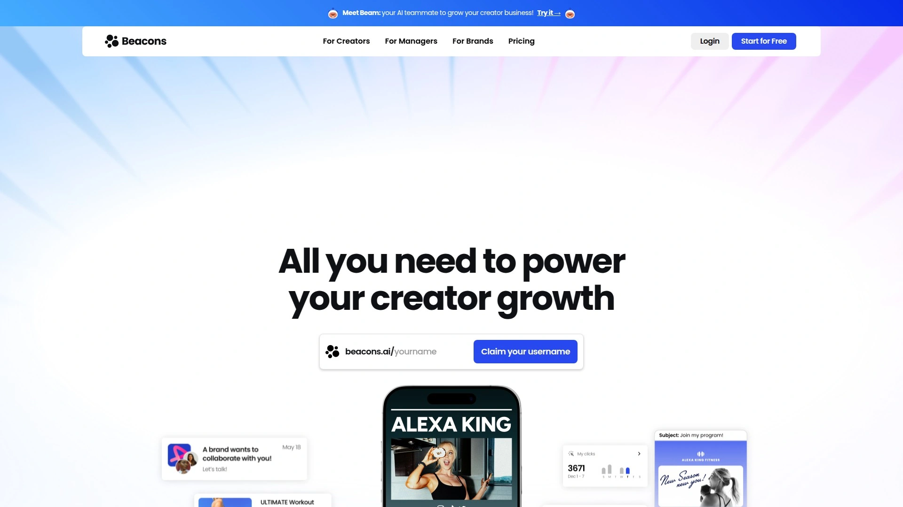

Beacons extends beyond simple link-in-bio functionality to offer a comprehensive creator business platform. The system includes link management, email marketing, online store, booking system, media kit creation, and analytics all integrated into one environment. This consolidation eliminates the need for multiple subscriptions to separate services. Creators manage their entire online presence from a unified dashboard.

Link-in-bio pages display multiple destinations with customizable layouts and branding. Email marketing functionality builds lists and sends campaigns directly from Beacons. The integrated store sells digital products, physical goods, or services without external e-commerce platforms. Booking calendars schedule appointments or consultations. Media kits showcase creator statistics and offerings for brand partnerships.

Free plans provide core functionality including unlimited links, basic customization, and essential analytics. Paid upgrades unlock advanced features, custom domains, and white-labeling. The platform emphasizes mobile optimization for audiences primarily accessing content via smartphones. Analytics track page views, link clicks, product sales, and email campaign performance. Integration with payment processors enables direct monetization.

The comprehensive approach suits creators wanting consolidated tools over best-of-breed solutions. The downside involves less depth in individual features compared to specialized tools. Learning curve runs higher due to expanded functionality. For creators prioritizing convenience and consolidation over specialized capabilities, Beacons delivers multi-functional value.

***

## **[Tap Bio](https://tap.bio)**

Story-style swipeable cards optimized for Instagram aesthetics.

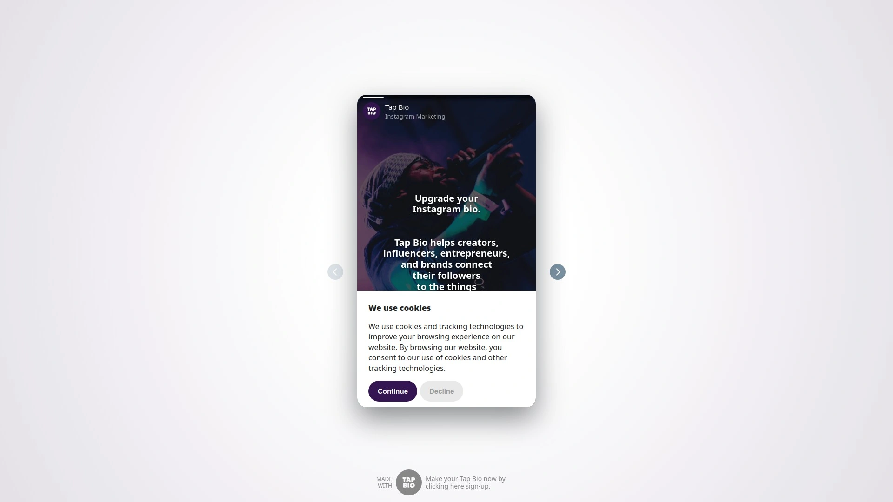

Tap Bio differentiates itself through card-based presentation mimicking Instagram Stories format. Users swipe left and right through different cards instead of scrolling a traditional link list. This familiar interaction pattern feels native to Instagram users. Card types include simple links, multiple link collections, Instagram post displays, image galleries, YouTube embeds, and email collection forms.

The platform automatically pulls Instagram posts with attached links, keeping your Tap Bio updated as you publish. This automation reduces maintenance compared to manually updating link pages. Full-screen background images create visual impact. Prominent buttons drive action. The mobile-first design optimizes for smartphone viewing.

Free plans limit you to one profile and one link. Silver plans at $3 monthly add three more cards and basic analytics. Gold plans at $8 monthly provide unlimited cards, Facebook tracking pixel, Google Analytics integration, and management of multiple Instagram accounts. The platform removes its own branding on paid plans.

User reports indicate sync issues between Instagram and Tap Bio, with posts sometimes failing to update automatically. Customer support receives criticism for slow response times and unresolved technical problems. Desktop optimization lags behind mobile, affecting creators managing links from computers. Competitors like Beacons and Lnk.Bio offer similar features with better reliability. For Instagram-focused creators wanting story-style presentation despite potential technical issues, Tap Bio provides unique aesthetics.

***

## **[Shorby](https://shorby.com)**

Instagram-focused bio pages with messenger links and smart pages.

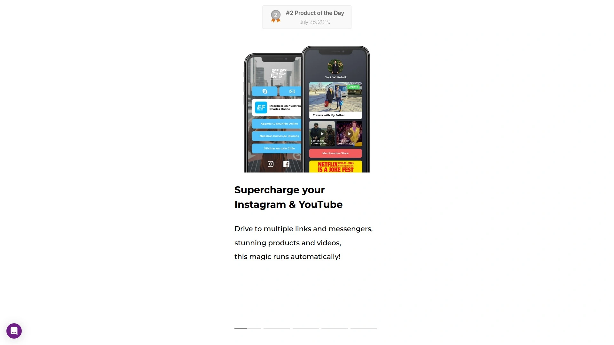

Shorby specializes in Instagram bio link pages optimized for e-commerce and social media marketing. The platform emphasizes direct messaging connections, adding WhatsApp, Facebook Messenger, Telegram, and other chat links prominently on bio pages. This instant communication focus suits businesses prioritizing customer interaction. Smart pages dynamically change content based on traffic source, showing different links to visitors from Instagram versus TikTok.

Link analytics track clicks, views, and engagement metrics. Geographic data shows where audiences concentrate. Device information reveals mobile versus desktop usage patterns. The platform supports custom domains for branded bio URLs. Multiple profiles manage different brands or accounts from single logins. Team collaboration enables agencies managing multiple clients.

Integration with major social platforms simplifies content pulling and updating. The interface maintains visual simplicity while offering decent customization options. Pricing starts at $15 monthly for basic features, scaling to $99 monthly for advanced plans. The cost runs higher than some alternatives while offering fewer features than comprehensive competitors. Limited functionality compared to platforms like Replug or Bitly narrows Shorby's appeal.

The Instagram specialization benefits creators and businesses heavily invested in that platform. The messenger link emphasis suits customer service-focused operations. For Instagram-centric businesses prioritizing direct communication over advanced analytics, Shorby delivers focused functionality.

---

## FAQ

**Can link management tools really help me build remarketing audiences without owning the content?**

Platforms like RocketLink, Replug, and T2M add retargeting pixels to any URL you share, capturing clicks as potential customers even when linking to external content. This works by routing the link through the platform's infrastructure where pixels fire before redirecting to the final destination. You're building Facebook, Google, LinkedIn, and other platform audiences from every link you share across social media, emails, or messages. The approach proves particularly valuable for marketers without websites who still want to leverage remarketing technologies.

**How do custom domains improve click rates on shortened links?**

Branded short links using your own domain receive up to 39% more clicks than generic shortener URLs because audiences trust familiar domains. Services like Rebrandly, Bitly, and Short.io let you create links like yourbrand.co/offer instead of bit.ly/x7k2m. Custom domains also reinforce brand identity with every link shared, turning URLs into marketing assets rather than forgettable strings. Most platforms now offer custom domains even on free plans, removing cost barriers to professional link branding.

**What's the difference between link-in-bio tools and URL shorteners with bio features?**

Dedicated link-in-bio tools like Linktree and Beacons focus exclusively on creating mobile-optimized landing pages listing multiple destinations. URL shorteners like Bitly and Replug include bio page features alongside comprehensive link management, analytics, and retargeting capabilities. Choose dedicated tools when you only need social media bio pages. Select full-featured shorteners when you want bio functionality plus advanced marketing features like CTA overlays, A/B testing, and pixel tracking across all your links.

---

## Conclusion

Smart link management transforms every URL from a simple redirect into a trackable, brandable, retargetable connection with potential customers. [RocketLink](https://rocketlink.io) leads this ranking because adding retargeting pixels, custom CTAs, and detailed analytics to any link you share—including external content you don't own—maximizes the marketing value of every piece of content you distribute. Whether you're building Facebook audiences from shared articles, capturing emails through CTA overlays, or simply tracking which links drive actual traffic, turning ordinary URLs into audience-building machines changes how effectively you convert shares into conversions.
